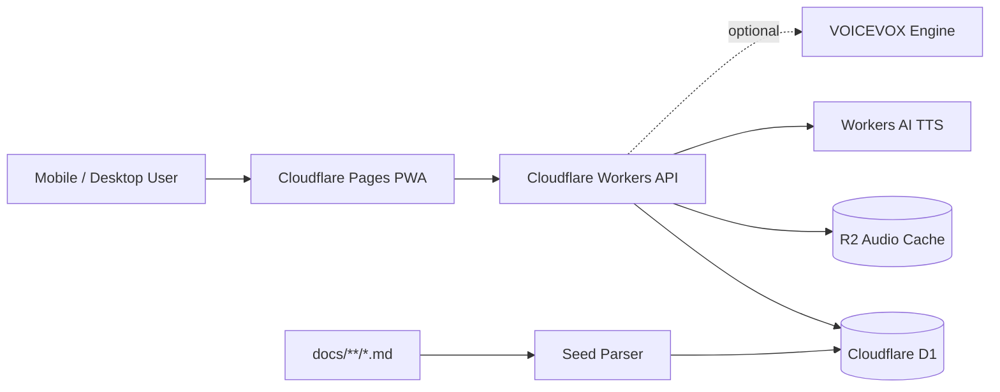

# Nihongo N3

한국어 사용자를 위한 JLPT N5-N3 학습 PWA입니다. 현재 저장소는 React 웹 앱, Cloudflare Workers API, D1 데이터베이스, R2 오디오 캐시, Workers AI/VOICEVOX 확장형 TTS 파이프라인을 함께 관리하는 pnpm 모노레포입니다.

> 기준일: 2026-06-02 KST  
> 기본 언어: 한국어  
> 지원 언어팩: 한국어, 일본어, 영어

## Live

| 영역 | 주소 |
|---|---|
| Web PWA | https://nihongo-n3.pages.dev |
| Workers API | https://nihongo-n3-api.kordokrip.workers.dev |
| API Docs | https://nihongo-n3-api.kordokrip.workers.dev/api/docs |
| OpenAPI | https://nihongo-n3-api.kordokrip.workers.dev/openapi.json |

## Product Snapshot

| 메뉴 | 현재 기능 |
|---|---|
| 홈 | 오늘 복습량, 신규 카드, 주간 진행률, 빠른 진입 동선을 제공합니다. |
| 복습 | FSRS 기반 카드 복습, 발음 재생, 평가 버튼, 카드 뒤집기 UX를 제공합니다. |
| 찾아보기 | 어휘, 문법, 한자 콘텐츠를 API와 IndexedDB 캐시 기반으로 탐색합니다. |
| 퀴즈 | 어휘 선택, 한자 읽기, 문법 빈칸, 청해 퀴즈 흐름을 제공합니다. |
| 독해 | 지문 목록, 상세 지문, 문제 제출 흐름을 제공합니다. |
| 커리큘럼 | 16주 학습 계획과 주차별 진행 기준을 제공합니다. |
| 자가진단 | 학습 상태 점검과 추천 진입점을 제공합니다. |
| 통계 | 스트릭, 카드 상태, 주간 학습 히트맵을 표시합니다. |
| 설정 | 언어, 테마, 후리가나, 음성, TTS provider, PWA 옵션을 관리합니다. |
| Audio QA | Cloudflare, Browser voice, VOICEVOX 후보를 30개 샘플로 비교합니다. |

## Architecture

```text
nihongo-n3
├─ apps/web          React + Vite + PWA + i18n + IndexedDB
├─ apps/api          Cloudflare Workers + Hono + OpenAPI
├─ packages/db       D1 schema, migrations, seed, verify
├─ packages/shared   Zod schema, FSRS adapter, shared contracts
├─ packages/content  docs 기반 콘텐츠 메타데이터
├─ e2e               Playwright smoke, PWA, visual, mobile touch tests
├─ docs              운영 문서와 JLPT 학습 원문
└─ .github           Pages, Workers, D1, content update workflows
```



## What Makes It Different

- 한국어 학습자 기준의 N5-N3 콘텐츠와 UI 문구
- 모바일 PWA 우선 설계, iOS safe-area와 44px 터치 타깃 검수
- 모든 주요 메뉴의 desktop/mobile smoke test 고정
- OpenAPI 기반 Workers API와 D1 콘텐츠 파이프라인
- R2 오디오 캐시와 확장 가능한 TTS provider 구조
- Cloudflare 무료/저비용 인프라 중심 운영

## Tech Stack

| 계층 | 기술 |
|---|---|
| Web | React 18, Vite, Tailwind CSS, Zustand, TanStack Query, Dexie |
| i18n | i18next, react-i18next |
| API | Cloudflare Workers, Hono, @hono/zod-openapi, Scalar |
| DB | Cloudflare D1, Drizzle ORM |
| Audio | Cloudflare Workers AI, R2, Browser SpeechSynthesis, VOICEVOX adapter |
| SRS | shared FSRS adapter |
| QA | Vitest, Playwright Chromium/WebKit/mobile-webkit, visual snapshots |
| CI/CD | GitHub Actions, Cloudflare Pages, Workers, D1 workflows |

## Local Setup

```bash
pnpm install
pnpm -F @nihongo-n3/api dev
pnpm -F @nihongo-n3/web dev
```

기본 로컬 주소:

| 서비스 | 주소 |
|---|---|
| Web | http://localhost:5173 |
| API | http://localhost:8787 |

## Verification

가장 최근 통과한 핵심 검증:

```bash
pnpm -F @nihongo-n3/web typecheck
pnpm -F @nihongo-n3/web test:run
pnpm -F @nihongo-n3/web build
pnpm -F @nihongo-n3/e2e exec playwright test responsive-ui.spec.ts menu-smoke.spec.ts visual-regression.spec.ts mobile-touch-audit.spec.ts --project=chromium
pnpm -F @nihongo-n3/e2e exec playwright test responsive-ui.spec.ts pwa.spec.ts menu-smoke.spec.ts mobile-touch-audit.spec.ts --project=webkit --project=mobile-webkit
```

최근 결과:

| 검증 | 결과 |
|---|---|
| Web typecheck | pass |
| Web unit tests | 17 pass |
| Web production build | pass |
| Chromium UI/menu/visual/touch | 28 pass |
| WebKit/mobile-webkit PWA/menu/touch | 23 pass |

## Deploy

API:

```bash
pnpm -F @nihongo-n3/api deploy
```

Web:

```bash
VITE_API_URL=https://nihongo-n3-api.kordokrip.workers.dev pnpm -F @nihongo-n3/web build
wrangler pages deploy apps/web/dist --project-name=nihongo-n3 --branch=main
```

D1 seed:

```bash
pnpm -F @nihongo-n3/db seed:remote
pnpm -F @nihongo-n3/db verify:remote
```

## Audio Roadmap

현재 오디오 구조는 다음 provider를 염두에 두고 확장됩니다.

| Provider | 용도 |
|---|---|
| browser | 사용자의 브라우저/iOS 네이티브 음성으로 즉시 재생 |
| cloudflare | Workers AI 기반 서버 TTS와 R2 캐시 |
| voicevox | 외부 HTTPS VOICEVOX Engine 연결 후 고품질 일본어 QA 비교 |
| style-bert-vits2 | 추후 자체 호스팅 후보 |

VOICEVOX 연결 예시:

```bash
node scripts/voicevox-connect.mjs --url https://VOICEVOX_ENGINE_URL --speaker 3
node scripts/voicevox-connect.mjs --url https://VOICEVOX_ENGINE_URL --speaker 3 --apply --warmup
```

연결 후 `/audio-qa`에서 30개 샘플을 비교하고, 우세한 provider를 R2 배치 재생성 대상으로 선택합니다.

## Operations Notes

- 외부 유료 API 의존성은 추가하지 않습니다.
- Cloudflare Access 보호 route 운영 전 `CF_ACCESS_AUD`, `CF_TEAM_DOMAIN`, policy 설정이 필요합니다.
- `.dev.vars`, `.env*`, `.wrangler`, 빌드 산출물, Playwright 리포트는 커밋하지 않습니다.
- `.git`이 없는 복사본에서는 `seed-diff` 같은 git diff 기반 검증이 제한됩니다. 현재 저장소는 다시 Git 초기화 및 원격 연결이 완료된 상태입니다.

## Project Status

이 저장소는 현재 “학습 콘텐츠 문서만 있는 폴더”가 아니라 실제 운영 가능한 PWA 모노레포입니다. 앞으로의 우선순위는 다음입니다.

1. VOICEVOX 운영 URL 연결과 30개 청감 QA
2. 실제 데이터 기반 빈 상태/onboarding UX 강화
3. API wrapper route의 OpenAPI 명세 완전 통일
4. Cloudflare Access 운영 변수 정리
5. 콘텐츠 의미/예문/청해 오디오 품질 보강

## License

See [LICENSE](./LICENSE).
