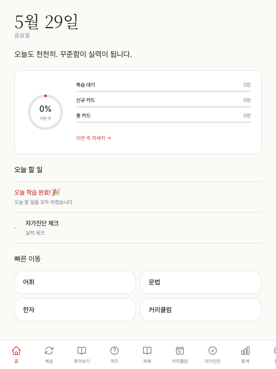
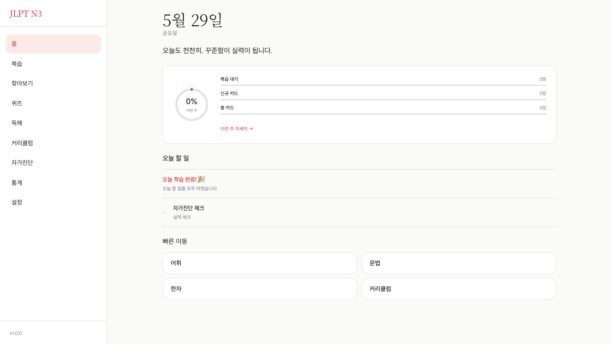
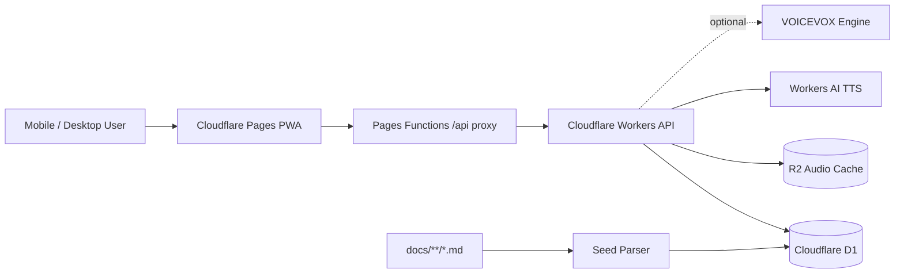

# Nihongo N3

<p align="center">
  
</p>

한국어 사용자가 일본어를 “앱을 켤 때마다 이어서 공부할 수 있게” 만든 JLPT N5-N3 학습 PWA입니다.
단어장, 문법표, 청해 파일, 복습 앱을 따로 오가던 흐름을 하나의 계정 기반 학습 루틴으로 묶는 것이 목표입니다.

이 저장소는 단순한 정적 웹사이트가 아니라 React PWA, Cloudflare Workers API, D1 데이터베이스, R2 오디오 캐시, FSRS 복습 알고리즘, Google SSO, 관리자 회원 관리까지 포함한 pnpm 모노레포입니다.

> 기본 언어: 한국어  
> 언어팩: 한국어, 일본어, 영어
> 기준일: 2026-06-05 KST

## Live

| 영역 | 주소 |
|---|---|
| Web PWA | https://nihongo-n3.pages.dev |
| Workers API | https://nihongo-n3-api.kordokrip.workers.dev |
| API Docs | https://nihongo-n3-api.kordokrip.workers.dev/api/docs |
| OpenAPI | https://nihongo-n3-api.kordokrip.workers.dev/openapi.json |

## Why I Built This

일본어 학습은 자료가 부족해서 막히기보다, 자료가 너무 흩어져서 끊깁니다. 어휘는 엑셀, 문법은 문서, 청해는 MP3, 복습은 다른 앱, 진도 관리는 또 다른 노트에 남습니다. 이 프로젝트는 그 조각들을 하나의 운영 가능한 학습 시스템으로 합치는 실험입니다.

Nihongo N3는 특히 한국어 사용자를 기준으로 설계했습니다.

- 한국어 의미를 먼저 안정적으로 잡고 일본어 표현으로 다시 올라갑니다.
- 히라가나, 가타카나, N5-N3 한자, 어휘, 문법, 예문, 독해, 청해를 한 흐름에 둡니다.
- FSRS 기반 복습으로 “오늘 다시 봐야 할 것”을 앱이 먼저 정리합니다.
- 퀴즈와 자가진단 결과를 계정에 저장해 다음 학습 화면에 반영합니다.
- iPhone Safari PWA, 모바일 터치 타깃, safe-area, WebKit 동작까지 실제 사용 환경을 기준으로 검증합니다.

디자인은 일본어 교재의 붉은 포인트, 검은 먹색, 따뜻한 종이 톤을 앱 UI로 옮기는 방향을 잡았습니다. 화려한 랜딩 페이지보다 매일 들어가도 피곤하지 않은 학습 도구가 목표입니다.

## Learning Design

| 학습 문제 | 앱에서의 해결 방식 |
|---|---|
| 외운 단어를 금방 잊는다 | FSRS-6 기반 SRS 카드와 Again/Hard/Good/Easy 평가 |
| 한자와 가나가 처음부터 부담스럽다 | 문자 암기 전용 화면, 단계별 관찰-회상-쓰기-즉시 테스트 흐름 |
| 문법을 예문 없이 외운다 | 문법 패턴과 예문을 연결하고 빈칸 퀴즈로 확인 |
| 청해 발음이 어색하다 | 브라우저 일본어 음성, 서버 오디오, VOICEVOX 후보를 비교 가능한 구조 |
| 공부한 기록이 흩어진다 | 로그인 기반 학습 기록, 퀴즈 시도, 자가진단, 통계 저장 |
| 모바일에서 UI가 답답하다 | Bottom tab, More sheet, iOS safe-area, 44px 이상 터치 타깃 검수 |
| 번역이 너무 직역스럽다 | 한국어 표현을 자연스러운 일본어 검색어로 바꾸는 AI 검색 보조 |

## Product Map

| 메뉴 | 현재 기능 |
|---|---|
| 홈 | 오늘 복습량, 신규 카드, 주간 진행률, 빠른 진입 동선을 보여줍니다. |
| 복습 | FSRS 카드, 발음 재생, 카드 뒤집기, 평가 버튼, 키보드 조작을 제공합니다. |
| 찾아보기 | 어휘, 문법, 한자 데이터를 검색하고 후리가나/발음/예문을 확인합니다. |
| 퀴즈 | 어휘 선택, 한자 읽기, 문법 빈칸, 청해 퀴즈를 생성하고 결과를 저장합니다. |
| 문자 암기 | 히라가나, 가타카나, N5-N3 한자를 한 글자씩 암기하도록 설계했습니다. |
| 독해 | 지문 목록, 상세 지문, 단어 검색 popover, 문제 제출 흐름을 제공합니다. |
| 커리큘럼 | 16주 학습 계획과 주차별 학습 기준을 제공합니다. |
| 자가진단 | JLPT/JF Can-do 기반 자기진단과 추천 학습 방향을 제공합니다. |
| 통계 | 스트릭, 카드 상태, 학습 히트맵을 표시합니다. |
| 설정 | 언어, 테마, 후리가나, 발음 음성, TTS provider, PWA 옵션을 관리합니다. |
| Audio QA | 30개 샘플로 Browser, Cloudflare, VOICEVOX 후보를 청감 비교합니다. |
| 관리자 | 회원, 활성 세션, 접속 이벤트를 확인합니다. |

## Screens

| Mobile | Desktop |
|---|---|
|  |  |

## Architecture

```text
nihongo-n3
├─ apps/web          React + Vite + PWA + i18n + IndexedDB + Pages Functions
├─ apps/api          Cloudflare Workers + Hono + OpenAPI + Google OAuth
├─ packages/db       D1 schema, migrations, seed, verify
├─ packages/shared   Zod schema, FSRS-6 adapter, shared contracts
├─ packages/content  docs 기반 콘텐츠 메타데이터
├─ e2e               Playwright smoke, auth, PWA, visual, mobile touch tests
├─ docs              운영 문서와 JLPT 학습 원문
└─ .github           Pages, Workers, D1, content update workflows
```



## Technical Highlights

- Same-origin API proxy: Pages Functions가 `/api/*`를 Workers API로 프록시해 Safari/PWA에서 세션 쿠키가 안정적으로 유지됩니다.
- Google SSO: OAuth callback은 Worker에서 받고, Pages 앱 세션으로 1회용 bridge token을 통해 연결합니다.
- FSRS-6: `packages/shared/src/fsrs.ts`에서 21 weights 기반 FSRS-6 스케줄러를 사용합니다.
- OpenAPI: Hono + `@hono/zod-openapi` + Scalar UI로 `/api/docs`를 제공합니다.
- Offline-first PWA: Workbox precache, API runtime cache, 오디오 cache, IndexedDB 학습 데이터 구조를 사용합니다.
- Audio pipeline: Browser SpeechSynthesis, Cloudflare Workers AI, R2 cache, VOICEVOX adapter 확장을 지원합니다.
- CI/CD: GitHub Actions로 Workers, Pages, D1 seed/backup, content update workflow를 관리합니다.

## Tech Stack

| 계층 | 기술 |
|---|---|
| Web | React 18, Vite, Tailwind CSS, Zustand, TanStack Query, Dexie |
| i18n | i18next, react-i18next |
| API | Cloudflare Workers, Hono, @hono/zod-openapi, Scalar |
| DB | Cloudflare D1, Drizzle ORM |
| Auth | App session, Google OAuth, Pages Functions API proxy |
| Audio | Cloudflare Workers AI, R2, Browser SpeechSynthesis, VOICEVOX adapter |
| SRS | FSRS-6 shared adapter |
| QA | Vitest, Playwright Chromium/WebKit/mobile-webkit, visual snapshots |
| CI/CD | GitHub Actions, Cloudflare Pages, Workers, D1 workflows |

## Local Setup

```bash
pnpm install
pnpm -F @nihongo-n3/api dev
pnpm -F @nihongo-n3/web dev
```

| 서비스 | 주소 |
|---|---|
| Web | http://localhost:5173 |
| API | http://localhost:8787 |

로컬 웹은 Vite proxy로 `/api/*`를 `http://localhost:8787`에 연결합니다. 운영 웹은 Pages Functions로 같은 역할을 수행합니다.

## Verification

최근 안정화 후 확인한 핵심 검증입니다.

```bash
pnpm -F @nihongo-n3/web typecheck
pnpm -F @nihongo-n3/web test:run
pnpm -F @nihongo-n3/web build
pnpm -F @nihongo-n3/api test
pnpm -F @nihongo-n3/e2e exec playwright test auth.spec.ts quiz-modes.spec.ts menu-smoke.spec.ts --project=chromium
pnpm -F @nihongo-n3/e2e exec playwright test auth.spec.ts --project=webkit
```

| 검증 | 최근 결과 |
|---|---|
| API tests | 60 pass |
| Web typecheck | pass |
| Web unit tests | pass |
| Web production build | pass |
| Local auth/menu/quiz E2E | 12 pass |
| Production Chromium auth/menu/quiz E2E | 12 pass |
| Production WebKit auth E2E | 6 pass |

## Deploy

API:

```bash
cd apps/api
wrangler deploy
```

Web:

```bash
pnpm -F @nihongo-n3/web build
wrangler pages deploy dist --project-name=nihongo-n3 --branch=main --cwd apps/web
```

D1 seed:

```bash
pnpm -F @nihongo-n3/db seed:remote
pnpm -F @nihongo-n3/db verify:remote
```

## Google OAuth

운영 OAuth 클라이언트에는 아래 값이 필요합니다.

| 항목 | 값 |
|---|---|
| 승인된 JavaScript 원본 | `https://nihongo-n3.pages.dev` |
| 승인된 리디렉션 URI | `https://nihongo-n3-api.kordokrip.workers.dev/api/v1/auth/google/callback` |

현재 구조는 Worker callback을 유지하면서 Pages 앱 세션으로 로그인 완료 상태를 전달합니다. 이 방식은 기존 Google Console 설정과 호환하면서도 실제 앱 호출은 같은 출처 `/api/v1/*`로 안정화하기 위한 절충입니다.

## Audio Roadmap

일본어 발음은 학습 체감 품질에 바로 영향을 주기 때문에 별도 QA 흐름을 둡니다.

| Provider | 용도 |
|---|---|
| browser | 사용자의 브라우저/iOS 네이티브 일본어 음성으로 즉시 재생 |
| cloudflare | Workers AI 기반 서버 TTS와 R2 캐시 |
| voicevox | 외부 HTTPS VOICEVOX Engine 연결 후 고품질 일본어 QA 비교 |
| style-bert-vits2 | 추후 자체 호스팅 후보 |

VOICEVOX 연결 예시:

```bash
node scripts/voicevox-connect.mjs --url https://VOICEVOX_ENGINE_URL --speaker 3
node scripts/voicevox-connect.mjs --url https://VOICEVOX_ENGINE_URL --speaker 3 --apply --warmup
```

연결 후 `/audio-qa`에서 30개 샘플을 비교하고, 우세한 provider를 R2 배치 재생성 대상으로 선택합니다.

## Operations Notes

- 외부 유료 API 의존성은 추가하지 않습니다.
- 기본 언어는 한국어이며, 일본어/영어는 UI 언어팩으로 관리합니다.
- `.dev.vars`, `.env*`, `.wrangler`, 빌드 산출물, Playwright 리포트는 커밋하지 않습니다.
- Cloudflare Access 보호 route 운영 전 `CF_ACCESS_AUD`, `CF_TEAM_DOMAIN`, policy 설정이 필요합니다.
- `seed-diff`는 git diff 기반이므로 `.git`이 없는 복사본에서는 제한됩니다. 현재 저장소는 GitHub 원격 연결이 완료된 상태입니다.

## Project Direction

다음 단계는 “기능을 더 많이 넣기”보다 “학습 체감 품질을 올리는 것”입니다.

1. VOICEVOX 운영 URL 연결과 30개 청감 QA
2. 전체 단어/예문/퀴즈 오디오의 R2 배치 재생성
3. 빈 상태와 onboarding을 실제 학습 데이터 기반으로 개선
4. OpenAPI wrapper route 명세 완전 통일
5. 콘텐츠 의미, 예문, 청해 문장 품질 보강
6. FSRS 개인화 optimizer 운영 연결 여부 결정

## License

See [LICENSE](./LICENSE).
